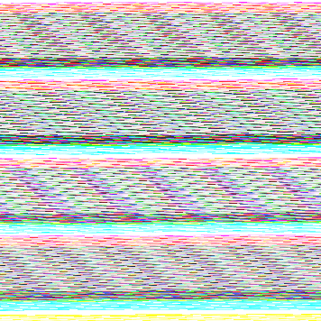

# Wide Residual Networks Using Ensemble

Wide-residual network implementations for cifar10, cifar100, and other kaggle challenges

Torch Implementation of Sergey Zagoruyko's [Wide Residual Networks](https://arxiv.org/pdf/1605.07146v2.pdf).

In order to figure out what 'width' & 'height' does on wide-residual networks, 
several experiments were conducted on different settings of weights and heights.
It turns out that **increasing the number of filters(increasing width)** gave more positive influence 
to the model than making the model deeper.

Last but not least, simply averaging a few models with different parameter settings showed a significant increase in both top1 and top5 accuracy. The CIFAR dataset test results approached to **97.12%** for CIFAR-10, and **84.19%** for CIFAR-100 with only **meanstd** normalization.

## Requirements
See the [installation instruction](INSTALL.md) for a step-by-step installation guide.
See the [server instruction](SERVER.md) for server setup.
- Install [Torch](http://torch.ch/docs/getting-started.html)
- Install [cuda-8.0](https://developer.nvidia.com/cuda-downloads)
- Install [cudnn v5.1](https://developer.nvidia.com/cudnn)
- Install luarocks packages
```bash
$ luarocks install cutorch
$ luarocks install xlua
$ luarocks install optnet
```
## Directions and datasets
- modelState    : The best model will be saved in this directory
- datasets      : Data preparation & preprocessing directory
- networks      : Wide-residual network model structure file directory
- gen           : Generated t7 file for each dataset will be saved in this directory
- scripts       : Directory where the run file scripts are contained

## Best Results

CIFAR-10's top1 accuracy reaches to **97.12%** only with average ensembling without any weight adjustments.

Adapting weight adjustments for each model will promise a more improved accuracy.

You can see that the ensemble network improves the results of single WRNs.

Test error (%, random flip, **meanstd** normaliztion, median of 5 runs) on CIFAR:

|   Dataset   | network      |  Top1 Err(%) |
|:-----------:|:------------:|:------------:|
| CIFAR-10    | WRN-28x10    |     3.89     |
| CIFAR-10    | Ensemble-WRN |   **2.88**   |
| CIFAR-100   | WRN-28x10    |    18.85     |
| CIFAR-100   | Ensemble-WRN |  **15.81**   |

## How to run
You can train each dataset of either cifar10, cifar100 or svhn by running the script below.
```bash
$ ./scripts/[:dataset]_train.sh

# For example, if you want to train the model on cifar10, you simply type
$ ./scripts/cifar10_train.sh
```

You can test your own trained model of either cifar10, cifar100, svhn by running the script below.
```bash
$ ./scripts/[:dataset]_test.sh
```

To ensemble your multiple trained models of different parameters, follow the steps below.
```bash
$ vi ensemble.lua
# Press :32 in vi, which will move your cursor to line 32
ens_depth         = torch.Tensor({28, 28, 28, 28, 40, 40, 40})
ens_widen_factor  = torch.Tensor({20, 20, 20, 20, 10, 14, 14})
ens_nExperiment   = torch.Tensor({ 2,  3,  4,  5,  5,  4,  5})
```

After you set each parameter for your models, open [scripts/ensemble.sh](scripts/ensemble.sh)

```bash
$ vi scripts/ensemble.sh
# on the second line
export dataset=[:dataset] # put the dataset you want to ensemble your models.
export mode=[:mode]       # you can either choose 'avg', 'min', 'max'
```

Finally, run the script file.

```bash
$ ./scripts/ensemble.sh
```
## Implementation Details

* CIFAR-10, CIFAR-100

|   epoch   | learning rate |  weight decay | Optimizer | Momentum | Nesterov |
|:---------:|:-------------:|:-------------:|:---------:|:--------:|:--------:|
|   0 ~ 60  |      0.1      |     0.0005    | Momentum  |    0.9   |   true   |
|  61 ~ 120 |      0.02     |     0.0005    | Momentum  |    0.9   |   true   |
| 121 ~ 160 |     0.004     |     0.0005    | Momentum  |    0.9   |   true   |
| 161 ~ 200 |     0.0008    |     0.0005    | Momentum  |    0.9   |   true   |

* SVHN

|   epoch   | learning rate |  weight decay | Optimizer | Momentum | Nesterov |
|:---------:|:-------------:|:-------------:|:---------:|:--------:|:--------:|
|   0 ~ 80  |      0.01     |     0.0005    | Momentum  |    0.9   |   true   |
|  81 ~ 120 |     0.001     |     0.0005    | Momentum  |    0.9   |   true   |
| 121 ~ 160 |     0.0001    |     0.0005    | Momentum  |    0.9   |   true   |


## CIFAR-10 Results
 


Below is the result of the test set accuracy for **CIFAR-10 dataset** training.

**Accuracy is the average of 5 runs**

| network           | dropout | preprocess | GPU:0 | GPU:1 | per epoch    | accuracy(%) |
|:-----------------:|:-------:|:----------:|:-----:|:-----:|:------------:|:-----------:|
| pre-ResNet-1001   |    0    |   meanstd  |   -   |   -   | 3 min 25 sec |    95.08    |
| wide-resnet 28x10 |    0    |     ZCA    | 5.90G |   -   | 2 min 03 sec |    95.84    |
| wide-resnet 28x10 |    0    |   meanstd  | 5.90G |   -   | 2 min 03 sec |    96.01    |
| wide-resnet 28x10 |   0.3   |   meanstd  | 5.90G |   -   | 2 min 03 sec |    96.19    |
| wide-resnet 28x20 |   0.3   |   meanstd  | 8.13G | 6.93G | 4 min 10 sec |  **96.52**  |
| wide-resnet 40x10 |   0.3   |   meanstd  | 8.08G |   -   | 3 min 13 sec |    96.26    |
| wide-resnet 40x14 |   0.3   |   meanstd  | 7.37G | 6.46G | 3 min 23 sec |    96.31    |

## CIFAR-100 Results


Below is the result of the test set accuracy for **CIFAR-100 dataset** training.

**Accuracy is the average of 5 runs**

| network           | dropout |  preprocess | GPU:0 | GPU:1 | per epoch    | Top1 acc(%)| Top5 acc(%) |
|:-----------------:|:-------:|:-----------:|:-----:|:-----:|:------------:|:----------:|:-----------:|
| pre-ResNet-1001   |    0    |   meanstd   |   -   |   -   | 3 min 25 sec |    77.29   |    93.44    |
| wide-resnet 28x10 |    0    |     ZCA     | 5.90G |   -   | 2 min 03 sec |    80.03   |    95.01    |
| wide-resnet 28x10 |    0    |   meanstd   | 5.90G |   -   | 2 min 03 sec |    81.01   |    95.44    |
| wide-resnet 28x10 |   0.3   |   meanstd   | 5.90G |   -   | 2 min 03 sec |    81.47   |    95.53    |
| wide-resnet 28x20 |   0.3   |   meanstd   | 8.13G | 6.93G | 4 min 05 sec |  **82.43** |  **96.02**  |
| wide-resnet 40x10 |   0.3   |   meanstd   | 8.93G |   -   | 3 min 06 sec |    81.47   |    95.65    |
| wide-resnet 40x14 |   0.3   |   meanstd   | 7.39G | 6.46G | 3 min 23 sec |    81.83   |    95.50    |

## SVHN Results



Below is the result of the test set accrucay for **SVHN dataset** training.

**Accuracy is the result of 1 run**

| network           | dropout |  preprocess | GPU:0 |  per epoch    | Top1 acc(%)|
|:-----------------:|:-------:|:-----------:|:-----:|:-------------:|:----------:|
| wide-resnet 10x1  |   0.4   |   meanstd   | 0.91G |  1 min 37 sec |   93.815   |
| wide-resnet 10x8  |   0.4   |   meanstd   | 2.03G |  7 min 32 sec |   97.411   |
| wide-resnet 16x8  |   0.4   |   meanstd   | 2.92G | 14 min  8 sec |   98.229   | 
| wide-resnet 22x8  |   0.4   |   meanstd   | 3.73G | 21 min 11 sec |   98.348   |
